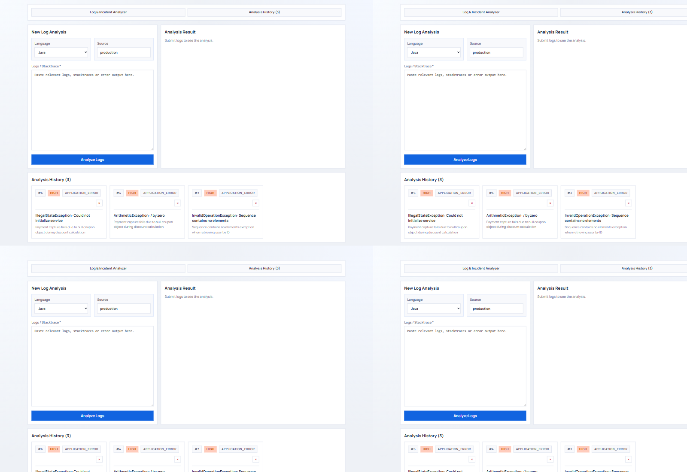
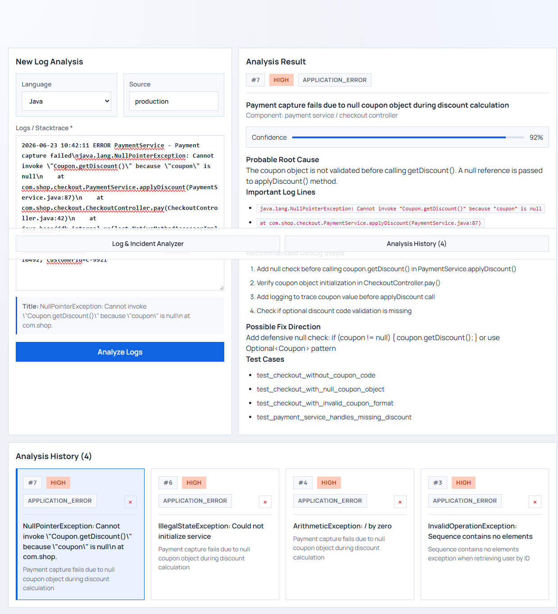

# Local LLM Log Analyzer

A local AI Engineering demo app that analyzes application logs and stacktraces with a local LLM through an OpenAI-compatible API.

The app is designed as a small portfolio project for software developers who want to demonstrate practical local LLM integration beyond RAG. It uses FastAPI, React, SQLite, Pydantic and either Ollama or LM Studio.

## Screenshots

### Dashboard



### Analysis result



## What this project demonstrates

- Local LLM integration through OpenAI-compatible APIs
- Provider compatibility with Ollama and LM Studio
- Structured JSON generation and validation with Pydantic
- Defensive JSON parsing for imperfect model output
- FastAPI backend with Swagger documentation
- React + TypeScript frontend
- SQLite persistence
- Service/repository architecture
- Automated tests with a fake LLM client
- A practical developer workflow: log and incident analysis

## Why this is a strong AI Engineering reference project

- End-to-end system design: frontend, API, service layer, persistence
- Model-provider abstraction: same app logic for Ollama and LM Studio
- Schema-first output design with validation and error handling
- Deterministic tests using a fake LLM client
- Ready-to-demo UX with history, severity badges and confidence score

## Use case

A developer pastes application logs, stacktraces or error messages into the frontend. The local LLM produces a structured incident analysis:

- incident type
- severity
- affected component
- short summary
- probable root cause
- important log lines
- recommended debug steps
- possible fix direction
- test cases
- confidence score

This is not a RAG system. There are no embeddings, no vector database and no document retrieval. The app analyzes the provided log input directly.

## Tech stack

- Python 3.11+
- FastAPI
- Pydantic v2
- OpenAI Python SDK for OpenAI-compatible local APIs
- SQLite
- Pytest
- React + TypeScript
- Vite

## Architecture

```text
React Frontend
      |
      v
FastAPI endpoints (app/main.py)
      |
      v
LogAnalysisService (app/services/log_analysis_service.py)
      |
      +--> LLMClient interface (app/llm/base.py)
      |        |
      |        +--> OpenAICompatibleLLMClient (app/llm/openai_compatible.py)
      |                |
      |                +--> Ollama or LM Studio
      |
      +--> LogAnalysisRepository (app/db/repository.py)
               |
               +--> SQLite
```

## Project structure

```text
local-llm-log-analyzer/
├── app/
│   ├── main.py
│   ├── config.py
│   ├── db/
│   │   └── repository.py
│   ├── llm/
│   │   ├── base.py
│   │   └── openai_compatible.py
│   ├── schemas/
│   │   └── log_analysis.py
│   └── services/
│       └── log_analysis_service.py
├── frontend/
│   ├── src/
│   ├── public/
│   ├── package.json
│   └── vite.config.ts
├── examples/
│   └── sample_log.txt
├── tests/
│   └── test_log_analysis_service.py
├── .github/workflows/
│   └── tests.yml
├── .env.example
├── .gitignore
├── requirements.txt
└── README.md
```

## Quickstart

### 1. Create and activate a virtual environment

Windows PowerShell:

```powershell
py -m venv .venv
.\.venv\Scripts\Activate.ps1
```

macOS/Linux:

```bash
python -m venv .venv
source .venv/bin/activate
```

### 2. Install backend dependencies

```bash
pip install -r requirements.txt
```

### 3. Install frontend dependencies

```bash
cd frontend
npm install
cd ..
```

### 4. Configure environment

Copy `.env.example` to `.env` and adjust values.

Ollama example:

```env
LLM_PROVIDER=ollama
LLM_BASE_URL=http://localhost:11434/v1
LLM_MODEL=llama3.2:latest
LLM_API_KEY=ollama
DATABASE_URL=log_analyses.db
```

LM Studio example:

```env
LLM_PROVIDER=lmstudio
LLM_BASE_URL=http://localhost:1234/v1
LLM_MODEL=local-model
LLM_API_KEY=lm-studio
DATABASE_URL=log_analyses.db
```

### 5. Ensure your local model is available

Ollama example:

```bash
ollama pull llama3.2:latest
ollama list
```

### 6. Run backend

```bash
py -m uvicorn app.main:app --reload
```

Swagger UI:

```text
http://127.0.0.1:8000/docs
```

## Frontend usage

### Option A: Development mode

Terminal 1:

```bash
py -m uvicorn app.main:app --reload
```

Terminal 2:

```bash
cd frontend
npm run dev
```

Open:

```text
http://localhost:5173
```

### Option B: Single URL on port 8000

Build frontend assets:

```bash
cd frontend
npm run build
cd ..
```

Run FastAPI:

```bash
python -m uvicorn app.main:app --host 127.0.0.1 --port 8000
```

Open:

```text
http://127.0.0.1:8000
```

FastAPI serves files from `frontend/dist` if the frontend has been built.

## API overview

| Method | Path | Purpose |
|---|---|---|
| GET | `/health` | Check service configuration |
| POST | `/logs/analyze` | Analyze and persist a log input |
| GET | `/logs` | List stored log analyses |
| GET | `/logs/{analysis_id}` | Fetch one stored analysis |
| DELETE | `/logs/{analysis_id}` | Delete one stored analysis |

## Example request

```powershell
$log = Get-Content .\examples\sample_log.txt -Raw
$body = @{
  title = "Checkout payment failure"
  language = "java"
  source = "production"
  raw_log = $log
} | ConvertTo-Json

Invoke-RestMethod -Uri http://127.0.0.1:8000/logs/analyze -Method Post -ContentType 'application/json' -Body $body | ConvertTo-Json -Depth 8
```

## Testing

```bash
pytest -q
```

## CI

GitHub Actions runs on each push and pull request:

- Backend: dependency install + pytest
- Frontend: npm install + lint + build

The tests do not require a running local LLM. They use a fake LLM client.

## Limitations

- No authentication or role-based access control
- No external log aggregation integration
- No background queue for very large logs
- SQLite only
- The LLM can be wrong; output should be reviewed by a developer
- This is a local demo, not a production incident management system

## Portfolio positioning

This project complements:

- a RAG app: document-based question answering
- a ticket triage app: support-ticket structuring
- this log analyzer: technical failure analysis from logs and stacktraces

Together, these projects demonstrate different AI Engineering patterns.

## License

MIT
